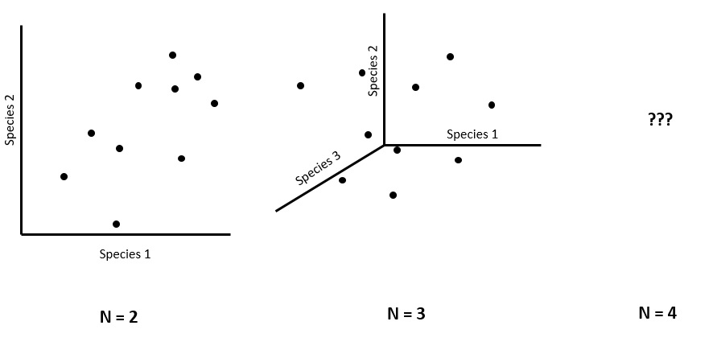

### 3.0 What is multivariate data

Multivariate data is what occurs when you have multiple response or predictor variables. Multivariate data is typically in the "wide" data format and can resemble items such as a list of species, soil chemistry variables, or plant traits. As ecologists trying to understand these variables, we need to minimize the dimensionality of these variables. The reason being is that we struggle to understand trends beyond 3-dimensions. 

Imagine plotting the abundance of one species against another. Then imagine adding a third species to that graph in the form of another axis. This might still make sense, now imagine adding a four axis, what does that look like? Imagine adding 35 axes. Because it is impossible to comprehend a multi-dimensional structure that comprises our multivariate data, we use data reduction techniques to put this information into two dimensions. 




### 3.1 Relevance of ecological indices

Ecological indices are an approach to simplify mutivariate data into univariate data to allow for easier analysis or description. Indices as a result have become incredibly popular for ecologists as a way to reduce the multi-dimensionality of ecosystems into something that is more manageable. One commonly described index is Shannon-Weaver's Diversity Index that produces a single value based on the relative abundances of many species. These indices have arguable benefits and limitations. With multivariate analyses becoming easier to conduct, there has been a departure from the majority of these indices. However, ecological indices are not going away just yet. Particularly, because science has a component of communication and making it easier to describe trends has obvious benefits. In other cases, indices can convey more information than the species identity on its own. 

Let's begin with a familiar one, Shannon-weaver's. This requires us to load the `vegan` library that is responsible for the majority of multivariate analyses in ecology. 

```{r warning=FALSE, message=FALSE}
library(vegan)
library(tidyverse)


data <- read.csv("multivar.csv")

#data <- read.csv("Indices//multivar.csv")

## check to see where the species list are
names(data)

## separate species and predictor columns
spp.data <- data[,7:46] ## select only species
pred.data <- data[,1:6] ## select only predictors and identifiers

## calculate shannon index
div.data <- diversity(spp.data, index = "shannon")

## combine with predictors
div.data <- cbind(pred.data, div.data)

## see what it looks like
head(div.data)

## example of plot
mean.div <- div.data %>% group_by(Microsite, Elevation) %>% summarize(Average.Diversity=mean(div.data))

ggplot(mean.div) + geom_bar(aes(x=Elevation, y=Average.Diversity, fill=Microsite), color="black", stat="identity", position = "dodge") + scale_fill_brewer()
```


