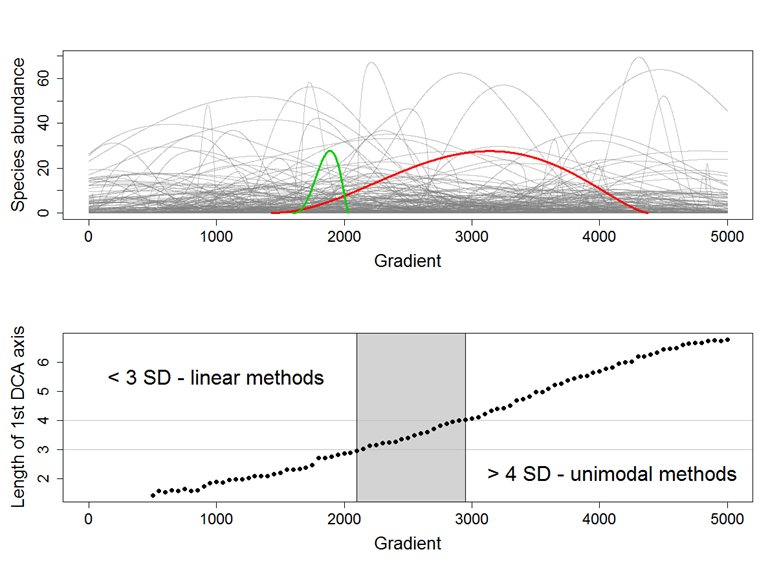

### 3.0 What is multivariate data

Multivariate data is what occurs when you have multiple response or predictor variables. Multivariate data is typically in the "wide" data format and can resemble items such as a list of species, soil chemistry variables, or plant traits. As ecologists trying to understand these variables, we need to minimize the dimensionality of these variables. The reason being is that we struggle to understand trends beyond 3-dimensions. 

Imagine plotting the abundance of one species against another. Then imagine adding a third species to that graph in the form of another axis. This might still make sense, now imagine adding a four axis, what does that look like? Imagine adding 35 axes. Because it is impossible to comprehend a multi-dimensional structure that comprises our multivariate data, we use data reduction techniques to put this information into two dimensions. 


### 3.1 Relevance of ecological indices

Ecological indices are an approach to simplify mutivariate data into univariate data to allow for easier analysis or description. Indices as a result have become incredibly popular for ecologists as a way to reduce the multi-dimensionality of ecosystems into something that is more manageable. One commonly described index is Shannon-Weaver's Diversity Index that produces a single value based on the relative abundances of many species. These indices have arguable benefits and limitations. With multivariate analyses becoming easier to conduct, there has been a departure from the majority of these indices. However, ecological indices are not going away just yet. Particularly, because science has a component of communication and making it easier to describe trends has obvious benefits. In other cases, indices can convey more information than the species identity on its own. 

Let's begin with a familiar one, Shannon-weaver's. This requires us to load the `vegan` library that is responsible for the majority of multivariate analyses in ecology. 

```{r warning=FALSE, message=FALSE}
library(vegan)
library(tidyverse)


data <- read.csv("multivar.csv")

#data <- read.csv("Indices//multivar.csv")

## check to see where the species list are
names(data)

## separate species and predictor columns
spp.data <- data[,7:46] ## select only species
pred.data <- data[,1:6] ## select only predictors and identifiers

## calculate shannon index
div.data <- diversity(spp.data, index = "shannon")

## combine with predictors
div.data <- cbind(pred.data, div.data)

## see what it looks like
head(div.data)

## example of plot
mean.div <- div.data %>% group_by(Microsite, Elevation) %>% summarize(Average.Diversity=mean(div.data))

ggplot(mean.div) + geom_bar(aes(x=Elevation, y=Average.Diversity, fill=Microsite), color="black", stat="identity", position = "dodge") + scale_fill_brewer()
```

Here, we have reduced the entire community composition into a single diversity index and used the mean to compare among sites. We can see that there appears to be a general trend with elevation. The sites at higher elevations tend to have larger differences between treatments. 

### 3.2 Effect-size estimates

What if we were less interested in the raw values of our diversity index and instead were more interested in the relative difference between our treatments. In this case, we want to know only if the shrub has relatively higher diversity than the open microsites, rather than what that value is.

These are generally called effect-size estimates and are popular in community ecology. One of the more commonly refered effect-size estimates are Hedge's g or Cohen's d. Both of these are often used in effect size estimates and are ratios of means and standard deviations between two populations. In this case, the two populations would be our two treatments. However, community ecology tends to use a few others. Two that are used commonly are log-response Ratio and relative interaction index. We will introduce the latter.

The relative interaction index (RII) was created by Cristina Armas in [opposition to LRR](https://esajournals.onlinelibrary.wiley.com/doi/full/10.1890/03-0650). It's benefits are in its simplicity. It is symetrical, between -1 and 1, where -1 is a control effect and +1 is a treatment effect. RII is also bound between -1 and 1 making it comparable to other studies or responses. The formula for it is below:
$$\frac{treatment - control}{treatment + control}$$

Where this shines for community ecology, is that treatment can represent the presence of competing of facilitating  species, and the control is the absence of that species. Let's go back to our previous example. We want to know if the shrub is having a facilitative (+1) or competitive (-1) effect on the entire plant community. We calculate RII using the RII function

```{r warning=FALSE, message=FALSE}
## Load RII function
source("rii.r")
se <- function(x) {sd(x)/sqrt(length(x))}


## convert identifier values as factors
div.data[,1:5] <- apply(data[,1:5], 2, as.factor)

## Use RII function to calculate RII
rii.data <- rii.fun(div.data, "Microsite", Shrub, Open)


## see what it looks like
head(rii.data)

## example of plot
mean.rii <- rii.data %>% group_by(Elevation) %>% summarize(RII.diversity=mean(div.data),error=se(div.data))

## plot RII with confidence band
ggplot(mean.rii, aes(x=Elevation, y=RII.diversity)) + geom_point() +  geom_errorbar(aes(ymin=RII.diversity-error, ymax=RII.diversity+error), width=.2)
  

## Add line of significant  
ggplot(mean.rii, aes(x=Elevation, y=RII.diversity)) + geom_point() +  geom_errorbar(aes(ymin=RII.diversity-error, ymax=RII.diversity+error), width=.2)+ geom_hline(yintercept=0, linetype="dashed", color = "red", lwd=1)

```

Once we plot the calculated RII effect sizes and their associated error we can see that there does not appear to be a significant facilitation effect at low elevations. However, at the highest elevations, the shrub is having a positive effect.

This can appear as an over simplification of your dataset, but effect size measures such as RII are useful for relative comparisons over larger gradients. For example, imagine you measured the relative different of every plant species along an elevation gradient. Trying to detect an observable trend in the relative differences of say 20 species using a bar graph is challenging. Additionally, effect size measures can be used to compare between predictors or responses variables to determine which is more strongly effected by the treatment.

For those looking for a more robust calculation of effect sizes, you can explore bootstrapped effect sizes using the package [bootES](https://www.ncbi.nlm.nih.gov/pubmed/23519455)

### 3.3 Ordinations

An ordination is a data reduction technique that uses significantly more complicated math than the above examples. The basic premise is that an ordination fits a linearly uncorrelated components through mulitvariate data to maximize the most variation explained. Similar to fitting a line-of-best-fit through a cloud of data points. There are different approaches both among ordinations and within ordinations, but conceptually this is what is occurring. Ordinations can generally be separated into three categories: unconstrained (indirect gradient analysis), constrained (direct gradient analysis), and NMDS. [This website](http://ordination.okstate.edu/overview.htm) does an excellent job breaking down all the different examples of each with a short description of what is occuring. 

Technically, NMDS is a type of unconstrained ordination. However, I have intentionally left it in a third category because it does something very different. NMDS calculates rank order and is a non-parametric version of other ordinations. Similar to how Kruskal-Wallis is the rank order equivalent of ANOVA. NMDS is hugely flexible and versatile, but is often criticised for not matching a distribution (again, like how Kruskal-Wallis does not follow a dsitribution) and the output may be suggested as correct, when it is not the optimal representation of data. The ecological community continues to debate this and for this exercise I will focus on principal component analysis (PCA) and redundancy analysis (RDA). However, for those interested in a great tutorial on NMDS check [here](https://jonlefcheck.net/2012/10/24/nmds-tutorial-in-r/).

### 3.4 PCA and CCA

PCA is a indirect gradient analysis. Indirect, in that we are trying to determine a principal component (line of best fit) through the data that explains the most variation but not  attribute that component to anything. We use the `dune` dataset within vegan as an example. 

```{r}
## Load data
data(dune)

## conduct pca
pca <- rda(dune)

## see output variables of PCA
summary(pca)

## plot PCA
biplot(pca)


```

We used the function `rda` from vegan because it calculates a PCA when no constraining factor is specified. We use this instead of the base R version of PCA `princomp` because it is less versatile and because the output from the `rda` function has more options that can be used in other analyses. 

Here PCA1 and PCA2 represents our indirect gradients that determine these species compositions. We are unsure what the mechanism behind these components are and that can be better understood in the constrained ordinations later. First, we check our ordination to make sure PCA1 and PCA2 are the best representations of our data. From the summary we can see that 29.5% and 21.6% of the variation is explained in those two axes, whereas the third only explains 9%. This suggests the first two axes are the best representation of our data. Finally, we look at the plot and use the clustering of species together to determine trends. Species that are parallel are correlated, species that are perpendicular are uncorrelated, and species that are opposite are negatively correlated. 

If we are working with species abundance data, it is commonly recommended to use Hellinger transformation. Hellinger has a few advantages including not giving rare species high weight and low sensitivity to double zeros. The double zero problem is when two sites mutually are without a certain species and thus are sorted as more similar because of this share dissimilarity. The [work of Legendre](http://adn.biol.umontreal.ca/~numericalecology/Reprints/Legendre_&_Gallagher.pdf) does a great job of explaining when transformations of ordinations are required.

Let's transform our data and present it again.

```{r}
## Load data
dune.hell <- decostand(dune, method="hellinger")

## conduct pca
pca <- rda(dune.hell)

## see output variables of PCA
summary(pca)

## plot PCA
biplot(pca)
```

We have improved the amount of variation explained and centralized the biplot. Overall, this is an improvement and we know the transformation has address underlying issues with the analysis. 

The next thing we want to do is determine whether we have captured the shape of the gradient. A PCA assumes a linear gradient, whereas a correspondance analysis (CA) assumes a unimodal relationship. Over larger gradients it is assumed that the species data will resemble a unimodal relationship. We can check this using a detrended correspondance analysis. A detrended correspondance analysis (DCA) can be used as its own form of analysis but it is another topic of debate like NMDS. However, DCA tends to be argued against more often than in favour. For the purposes of determining gradient shape, it is perfect. 

```{r}
## conduct DCA
dca <- decorana(dune.hell)
dca
```

The output of our dca suggests that our axis lengths for the first axes is 3.56. This correspond to the standard deviation of that components and suggest there could be unimodal distribution in the data. The approximate evaluation is as follows:
` PCA & RDA <3 and 4< CA & CCA`

Our number is in between suggesting that both linear and unimodal approximations of the data would be acceptable. 




Illustration of the rule how to select whether to use linear ordination methods (like PCA or RDA) or unimodal (CA, DCA or CCA) on the data. Upper diagram shows simulated community structured by a single environmental gradient, with number of species response curves. The diagram below shows the relationship between the length of the gradient sampled in the simulated community on the //x/-axis (in arbitrary units), and length of the first DCA ordination axies (in units of S.D.). The dataset which according to DCA is rather homogeneous (< 3 S.D.) has environmental gradient up to 2000 units long; the longer gradient results into heterogeneous dataset for which linear methods are not suitable. [OP of figure  & caption](https://www.davidzeleny.net/anadat-r/doku.php/en:ordination)


### 3.5 Redundancy analysis

Finally let's do a contrained ordination, RDA. A constrained ordination is a direct graident analysis because you suggesting what the composition of the components are that describe the data. Instead of the PC1 representing the x-axis, we will have RDA1 that is a combination of the predictor variables that we include. We can take a look at what this means. 

```{r}
## load soil chem variables
data(varechem)

## select only most important soil nutrients
nutrients <- varechem[1:20,c("N","P","K","Ca","Mg")]

## conduct RDA
rda <- rda(dune.hell, nutrients)

## output
rda
anova(rda)

## plot output
plot(rda)
```

There are two quick ways to determine if the RDA accurately describes the data. The key word in RDA is redundancy, implying that your gradient is essentially described twice. Once by the species data and once by the environmental variables. The more similar those describe the same trend, the greater redundancy and the better the ordination. Here, the eigenvalues for the constrained axes are about 75% of the unconstrained values that suggests there is some degree of redundancy, which is good. When we conduct a permutation test on the RDA we find no significance. 

The p value being close to 0.05 and the relatively high level of redundancy suggest that these nutrient variables are not accurately explaining all the variation in our dataset. When we look at the plot, we can see that RDA1 is comprised mostly of the nutrients. This suggest that RDA2 might be better describe with some additional variables that are not soil nutrients. This could improve our RDA fit and make it valid. As it stands now though, we cannot present this. 

### 3.6 Indiciator species analysis


### 3.7 Species accumulation curves
