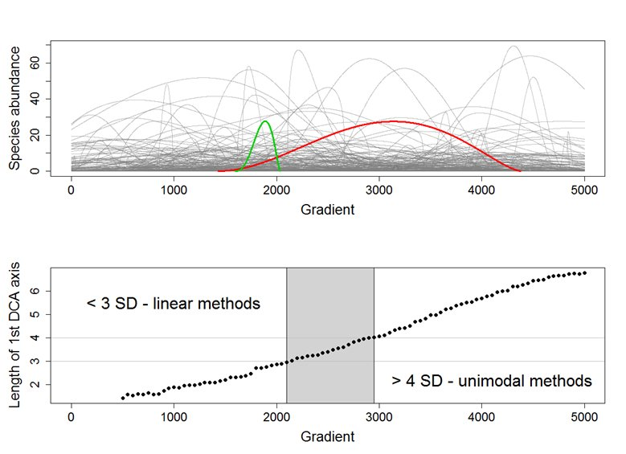

### 4.0 What are ordinations

An ordination is a data reduction technique that uses significantly more complicated math than the above examples. The basic premise is that an ordination fits a linearly uncorrelated components through mulitvariate data to maximize the most variation explained. Similar to fitting a line-of-best-fit through a cloud of data points. There are different approaches both among ordinations and within ordinations, but conceptually this is what is occurring. Ordinations can generally be separated into three categories: unconstrained (indirect gradient analysis), constrained (direct gradient analysis), and NMDS. [This website](http://ordination.okstate.edu/overview.htm) does an excellent job breaking down all the different examples of each with a short description of what is occuring. 

Technically, NMDS is a type of unconstrained ordination. However, I have intentionally left it in a third category because it does something very different. NMDS calculates rank order and is a non-parametric version of other ordinations. Similar to how Kruskal-Wallis is the rank order equivalent of ANOVA. NMDS is hugely flexible and versatile, but is often criticised for not matching a distribution (again, like how Kruskal-Wallis does not follow a dsitribution) and the output may be suggested as correct, when it is not the optimal representation of data. The ecological community continues to debate this and for this exercise I will focus on principal component analysis (PCA) and redundancy analysis (RDA). However, for those interested in a great tutorial on NMDS check [here](https://jonlefcheck.net/2012/10/24/nmds-tutorial-in-r/).

### 4.1 PCA and CCA

PCA is a indirect gradient analysis. Indirect, in that we are trying to determine a principal component (line of best fit) through the data that explains the most variation but not  attribute that component to anything. We use the `dune` dataset within vegan as an example. 

```{r warning=FALSE, message=FALSE}
library(vegan)

## Load data
data(dune)

## conduct pca
pca <- rda(dune)

## see output variables of PCA
summary(pca)

## plot PCA
biplot(pca)


```

We used the function `rda` from vegan because it calculates a PCA when no constraining factor is specified. We use this instead of the base R version of PCA `princomp` because it is less versatile and because the output from the `rda` function has more options that can be used in other analyses. 

Here PCA1 and PCA2 represents our indirect gradients that determine these species compositions. We are unsure what the mechanism behind these components are and that can be better understood in the constrained ordinations later. First, we check our ordination to make sure PCA1 and PCA2 are the best representations of our data. From the summary we can see that 29.5% and 21.6% of the variation is explained in those two axes, whereas the third only explains 9%. This suggests the first two axes are the best representation of our data. Finally, we look at the plot and use the clustering of species together to determine trends. Species that are parallel are correlated, species that are perpendicular are uncorrelated, and species that are opposite are negatively correlated. 

If we are working with species abundance data, it is commonly recommended to use Hellinger transformation. Hellinger has a few advantages including not giving rare species high weight and low sensitivity to double zeros. The double zero problem is when two sites mutually are without a certain species and thus are sorted as more similar because of this share dissimilarity. The [work of Legendre](http://adn.biol.umontreal.ca/~numericalecology/Reprints/Legendre_&_Gallagher.pdf) does a great job of explaining when transformations of ordinations are required.

Let's transform our data and present it again.

```{r}
## Load data
dune.hell <- decostand(dune, method="hellinger")

## conduct pca
pca <- rda(dune.hell)

## see output variables of PCA
summary(pca)

## plot PCA
biplot(pca)
```

We have improved the amount of variation explained and centralized the biplot. Overall, this is an improvement and we know the transformation has address underlying issues with the analysis. 

The next thing we want to do is determine whether we have captured the shape of the gradient. A PCA assumes a linear gradient, whereas a correspondance analysis (CA) assumes a unimodal relationship. Over larger gradients it is assumed that the species data will resemble a unimodal relationship. We can check this using a detrended correspondance analysis. A detrended correspondance analysis (DCA) can be used as its own form of analysis but it is another topic of debate like NMDS. However, DCA tends to be argued against more often than in favour. For the purposes of determining gradient shape, it is perfect. 

```{r}
## conduct DCA
dca <- decorana(dune.hell)
dca
```

The output of our dca suggests that our axis lengths for the first axes is 3.56. This correspond to the standard deviation of that components and suggest there could be unimodal distribution in the data. The approximate evaluation is as follows:
` PCA & RDA <3 and 4< CA & CCA`

Our number is in between suggesting that both linear and unimodal approximations of the data would be acceptable. 




Illustration of the rule how to select whether to use linear ordination methods (like PCA or RDA) or unimodal (CA, DCA or CCA) on the data. Upper diagram shows simulated community structured by a single environmental gradient, with number of species response curves. The diagram below shows the relationship between the length of the gradient sampled in the simulated community on the //x/-axis (in arbitrary units), and length of the first DCA ordination axies (in units of S.D.). The dataset which according to DCA is rather homogeneous (< 3 S.D.) has environmental gradient up to 2000 units long; the longer gradient results into heterogeneous dataset for which linear methods are not suitable. [OP of figure  & caption](https://www.davidzeleny.net/anadat-r/doku.php/en:ordination)


### 4.2 Redundancy analysis

Finally let's do a contrained ordination, RDA. A constrained ordination is a direct graident analysis because you suggesting what the composition of the components are that describe the data. Instead of the PC1 representing the x-axis, we will have RDA1 that is a combination of the predictor variables that we include. We can take a look at what this means. 

```{r}
## load soil chem variables
data(varechem)

## select only most important soil nutrients
nutrients <- varechem[1:20,c("N","P","K","Ca","Mg")]

## conduct RDA
rda <- rda(dune.hell, nutrients)

## output
rda
anova(rda)

## plot output
plot(rda)
```

There are two quick ways to determine if the RDA accurately describes the data. The key word in RDA is redundancy, implying that your gradient is essentially described twice. Once by the species data and once by the environmental variables. The more similar those describe the same trend, the greater redundancy and the better the ordination. Here, the eigenvalues for the constrained axes are about 75% of the unconstrained values that suggests there is some degree of redundancy, which is good. When we conduct a permutation test on the RDA we find no significance. 

The p value being close to 0.05 and the relatively high level of redundancy suggest that these nutrient variables are not accurately explaining all the variation in our dataset. When we look at the plot, we can see that RDA1 is comprised mostly of the nutrients. This suggest that RDA2 might be better describe with some additional variables that are not soil nutrients. This could improve our RDA fit and make it valid. As it stands now though, we cannot present this. 

### 3.6 Indiciator species analysis


